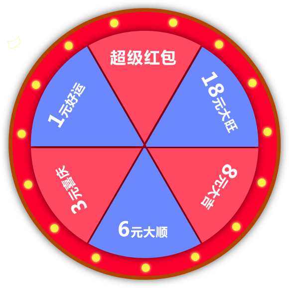

# CSS3转盘旋转抽奖

---

JS操作CSS3旋转属性`rotate`很方便把转盘旋转起来，但接口获取数据可能会延迟几秒，这导致网上搜索到DEMO不能满足需求，所以我在未获取接口数据前加入了预旋转，这样就算接口延迟也不会显的突兀。

`仅适合移动端使用`

---

## 使用

	<link rel="stylesheet" href="css/main.css">    
	                 

### HTML   

	

        

            

                
                <a href="javascript:;" class="turntalbe-arrow" id="lotteryBtn">
                    点击抽奖
                </a>
            

        

    
